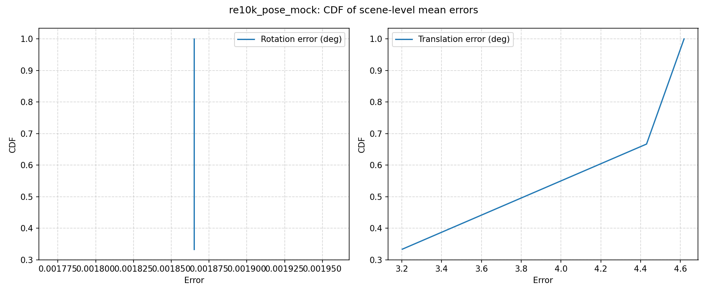
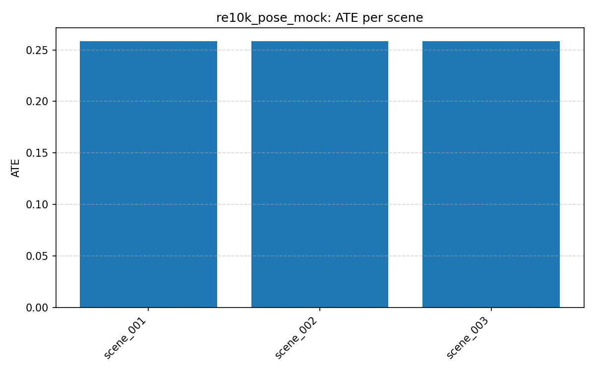
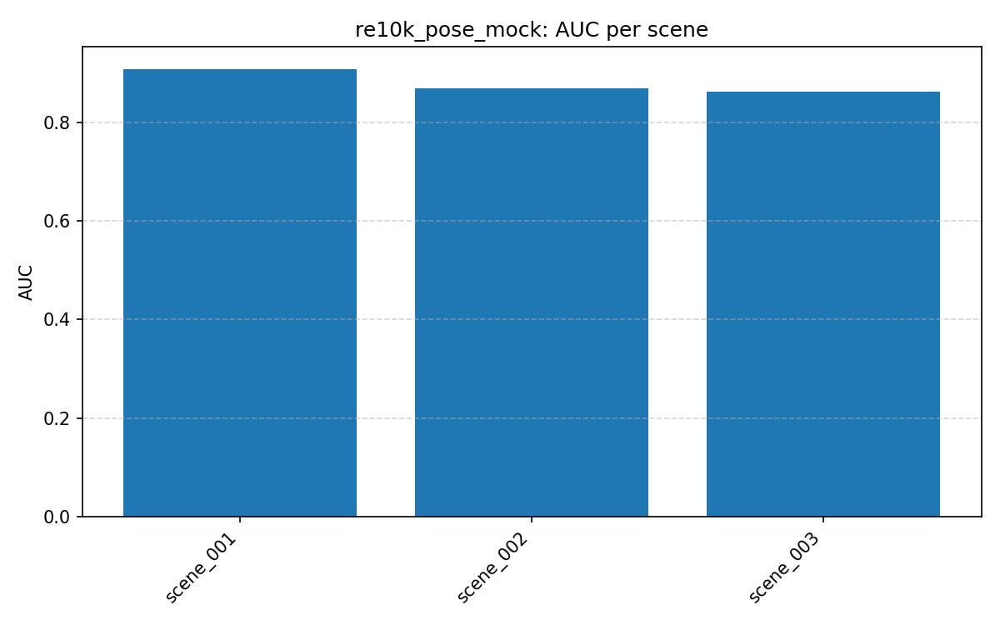
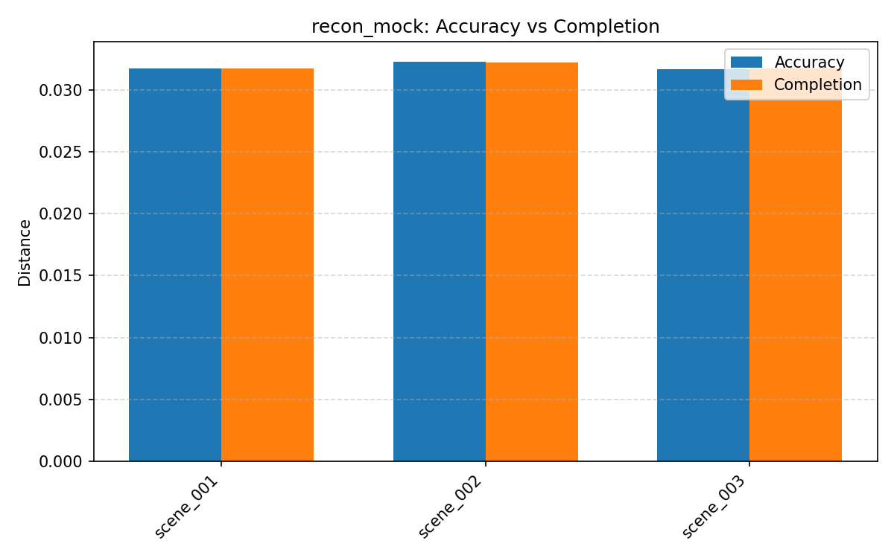

# Fast3R 量化评测 Baseline 报告

> 报告生成时间：2026-07-16
> 说明：当前运行环境无法安装 PyTorch / PyTorch3D（Python 3.13 + Intel Mac 无可用 wheel），因此本阶段使用 **mock 后端** 验证评测框架与指标计算流程。真实模型评测需在具备 CUDA/torch 的环境中运行。

## 1. 评测目标

建立可复现、可扩展的 Fast3R 量化评测体系，覆盖：

- **相机位姿估计**：ATE、RPE、相对旋转/平移角误差、AUC
- **三维重建质量**：Accuracy、Completion、Completion Ratio

## 2. 数据集与配置

| 配置 | 任务 | 配置文件 |
|------|------|----------|
| RE10K 位姿（mock） | pose | `configs/eval/benchmark_re10k.yaml` |
| 重建质量（mock） | recon | `configs/eval/benchmark_recon.yaml` |

mock 后端使用带噪声的模拟相机轨迹和点云，仅用于验证指标与流程。

## 3. 运行方式

```bash
# 位姿评测
python scripts/run_benchmark.py --config configs/eval/benchmark_re10k.yaml

# 重建评测
python scripts/run_benchmark.py --config configs/eval/benchmark_recon.yaml

# 可视化
python scripts/plot_benchmark_results.py \
    --json outputs/benchmark/re10k_pose_mock/re10k_pose_mock_per_scene.json \
    --out_dir docs/evaluation/figures
```

## 4. 当前 Mock 结果摘要

### 4.1 位姿估计（3 个模拟场景）

| 指标 | 均值 | 中位数 | 标准差 |
|------|------|--------|--------|
| rel_rotation_mean_deg | 0.0019 | 0.0019 | 0.0000 |
| rel_translation_mean_deg | 4.0837 | 4.4300 | 0.6279 |
| auc | 0.8810 | 0.8704 | 0.0199 |
| ate | 0.2586 | 0.2586 | 0.0000 |
| rpe_rotation_rmse_deg | 0.0000 | 0.0000 | 0.0000 |
| rpe_translation_rmse | 0.0228 | 0.0206 | 0.0036 |

### 4.2 重建质量（3 个模拟场景）

| 指标 | 均值 | 中位数 | 标准差 |
|------|------|--------|--------|
| accuracy_mean | 0.0319 | 0.0318 | 0.0003 |
| completion_mean | 0.0319 | 0.0318 | 0.0002 |
| completion_ratio | 0.9017 | 0.9000 | 0.0031 |

## 5. 可视化









## 6. 实现内容

新增/复用的核心文件：

- `fast3r/eval/pose_metric_np.py`：纯 NumPy 位姿指标（ATE、RPE、相对角误差、AUC）
- `fast3r/eval/benchmark.py`：统一评测执行器，支持 mock / model 两种后端
- `scripts/run_benchmark.py`：命令行入口
- `scripts/plot_benchmark_results.py`：结果可视化
- `configs/eval/benchmark_re10k.yaml`：RE10K 位姿评测配置
- `configs/eval/benchmark_recon.yaml`：重建评测配置

复用的现有文件：

- `fast3r/eval/recon_metric.py`：重建指标
- `fast3r/eval/cam_pose_metric.py`：真实环境下使用的 torch 版位姿指标

## 7. 限制与下一步

1. **当前为 mock 数据**：真实模型推理需要 torch/torchvision/hydra/open3d/rootutils/lightning 等依赖，且需要下载模型权重与 RE10K 数据集。
2. **缺少 F-score**：当前 `recon_metric.py` 未提供 F-score 实现，后续可补充。
3. **缺少真实数据集支持**：需在具备 CUDA 的环境中接入 `fast3r_re10k_pose_eval.py` 和实际数据加载。
4. **后续优化方向**：
   - 速度精度优化：基于本框架添加 profiling 与耗时统计。
   - 标定：在本框架中增加标定误差指标。

## 8. 结论

本阶段完成了评测框架的搭建，验证了位姿与重建指标的计算流程，输出了 mock baseline。待环境就绪后，只需将 backend 从 `mock` 切换为真实模型后端，即可在真实数据上跑通完整评测。
